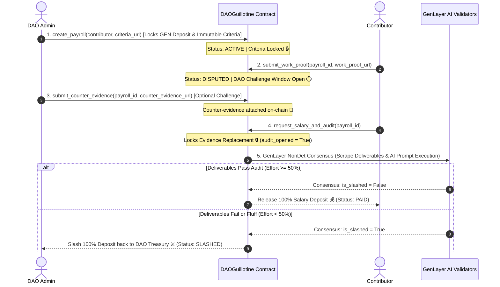

# DAOGuillotine // Decentralized Contributor Payout Auditor

[](https://genlayer.com)
[](https://github.com/Tannpd/DAOGuillotine)
[](https://daoguillotine-app.vercel.app)
[](https://studio.genlayer.com)
[](LICENSE)

---

## 📌 Problem Overview & Core Philosophy

In Web3 Decentralized Autonomous Organizations (DAOs), contributor payrolls and bounties suffer from two major systemic vulnerabilities:
1. **"Fake Work" & Meeting-Spam**: Contributors submitting superficial reports ("attended meetings," "Telegram chat activity," "GM tweets") to claim bounties without delivering tangible code, PRs, graphics, or deployed systems.
2. **Arbitrary DAO Withholding & Collusion**: DAOs withholding locked funds indefinitely or attempting premature deposit drains without providing objective evidence of non-performance.

**DAOGuillotine** solves this via GenLayer Intelligent Contracts:
* Locks contributor salary/bounties into an autonomous smart contract vault bound to **shared, immutable acceptance criteria**.
* Enforces a **multi-stage dispute lifecycle** with a dedicated **DAO Challenge Window** for counter-evidence submission.
* Leverages GenLayer AI Lead Auditor nodes (`gl.nondet.web.render` & `gl.nondet.exec_prompt`) to cross-examine deliverables against criteria and counter-evidence.
* Automatically slashes funds back to the DAO treasury if effort is insufficient (`score < 50`) or releases 100% salary to the contributor if deliverables pass audit.

---

## 🏛️ System Architecture & Workflow

### Multi-Stage Lifecycle Diagram



---

## 🛡️ Security & Lifecycle Guarantees

DAOGuillotine enforces 4 strict lifecycle security guarantees to prevent premature deposit drains, evidence tampering, and unauthorized access:

| Guarantee | Requirement | Enforcement Mechanism in Smart Contract |
| :--- | :--- | :--- |
| **1. Immutable Acceptance Criteria** | Shared, non-empty criteria policy URL set on creation | `create_payroll` rejects empty `acceptance_criteria_url`. No update function exists, rendering criteria 100% immutable. |
| **2. Real Challenge Window** | Dedicated window for DAO counter-evidence submission | Stage 1 `submit_work_proof` sets `status = "DISPUTED"` and opens the window for `submit_counter_evidence` prior to AI audit. |
| **3. Evidence Replacement Lock** | Permanently lock evidence URLs once AI audit starts | `request_salary_and_audit` sets `payroll_audit_opened = True`. Subsequent attempts raise `UserError("Evidence replacement is locked once audit has commenced.")`. |
| **4. Failed-Audit Deposit Reclaim** | No immediate DAO deposit drain on active payrolls | `reclaim_timed_out_payroll` requires `status == "FAILED"`, preventing premature reclaim while payroll is active. |

---

## ⚙️ Intelligent Contract API Reference

### Deployed Contract Address
* **GenLayer StudioNet**: `0x4c0433a5A6588f1fA1Eeeb5F116f861ADCdd37A6`

### Public Write Functions

#### `create_payroll(contributor: Address, acceptance_criteria_url: str) -> int` (payable)
* Locks native GEN deposit into escrow and binds contributor address with shared, immutable acceptance criteria URL.
* **Access Control**: Anyone (typically DAO Admin).
* **Validation**: Value > 0, non-zero contributor address, non-empty criteria URL starting with `http://` or `https://`.

#### `submit_work_proof(payroll_id: int, work_proof_url: str) -> None`
* Stage 1 of dispute lifecycle. Contributor files work proof URL, transitioning status to `DISPUTED` and opening the DAO Challenge Window.
* **Access Control**: Designated contributor only.
* **Validation**: `payroll_audit_opened == False`, status `ACTIVE`, domain whitelist check.

#### `submit_counter_evidence(payroll_id: int, counter_evidence_url: str) -> None`
* Allows DAO admin to attach dispute reports or bug logs during the Challenge Window prior to AI arbitration.
* **Access Control**: Designated DAO Admin only.
* **Validation**: `payroll_audit_opened == False`, status `ACTIVE` or `DISPUTED`, domain whitelist check.

#### `request_salary_and_audit(payroll_id: int, work_proof_url: str = "", counter_evidence_url: str = "") -> None`
* Sets `payroll_audit_opened = True` (locking evidence URLs permanently) and triggers GenLayer NonDet consensus.
* **Access Control**: Designated Contributor or DAO Admin.
* **Settlement**: Executes transfer to contributor if `is_slashed == False`, or returns funds to DAO treasury if `is_slashed == True`.

#### `reclaim_timed_out_payroll(payroll_id: int) -> None`
* Allows DAO admin to recover locked deposit ONLY if the audit officially failed (`status == "FAILED"`).
* **Access Control**: Designated DAO Admin only.

---

## 🧪 Automated Verification & Unit Test Suite

DAOGuillotine includes a 100% automated Python unit test suite executing against a mock GenLayer VM runtime:

```bash
# Execute unit test suite
python -m unittest discover -s tests -p "test_*.py" -v
```

### Test Results (10/10 PASSING)

```text
test_access_controls_for_roles (test_daoguillotine.TestDAOGuillotine) ... ok
test_create_payroll_requires_non_empty_criteria (test_daoguillotine.TestDAOGuillotine) ... ok
test_get_payroll_out_of_bounds (test_daoguillotine.TestDAOGuillotine) ... ok
test_prevent_evidence_replacement_after_audit_commences (test_daoguillotine.TestDAOGuillotine) ... ok
test_reclaim_requires_failed_audit_status (test_daoguillotine.TestDAOGuillotine) ... ok
test_reproducible_compilation (test_daoguillotine.TestDAOGuillotine) ... ok
test_slashing_path_when_effort_insufficient_or_bug_reported (test_daoguillotine.TestDAOGuillotine) ... ok
test_strict_boolean_validation_rejects_string_boolean (test_daoguillotine.TestDAOGuillotine) ... ok
test_submit_work_proof_stage1_and_challenge_window (test_daoguillotine.TestDAOGuillotine) ... ok
test_unauthorized_domain_origin_rejected (test_daoguillotine.TestDAOGuillotine) ... ok

----------------------------------------------------------------------
Ran 10 tests in 0.007s

OK
```

---

## 💻 Frontend Web dApp & Live Demo

The **DAOGuillotine Web Application** features a modern Web3 dark neon aesthetic built with React, Lucide Icons, and custom Glassmorphism styling:

* **Production URL**: 👉 **[https://daoguillotine-app.vercel.app](https://daoguillotine-app.vercel.app)**
* **Features**:
  * **Interactive Landing Page**: Hero section with real-time on-chain KPI cards (`Vault Value Locked`, `Total Dossiers`, `Contributors Paid`, `Fluff Slashed`).
  * **Bounty Escrow Intake Form**: Lock bounties with shared, immutable criteria URLs.
  * **Cabinet Dossier Drawer**: Inspect registered cases, view AI Productivity Gauged value, and review AI Auditor Decree Logs.
  * **Multi-Stage Action Controls**: Separate buttons for Stage 1 Work Proof Submission, DAO Counter-Evidence Attachment, and AI Audit Execution.

---

## 🚀 Local Development Setup

```bash
# Clone the repository
git clone https://github.com/Tannpd/DAOGuillotine.git
cd DAOGuillotine

# Run unit test suite
python -m unittest discover -s tests -p "test_*.py" -v

# Run frontend locally
cd frontend
npm install
npm run dev
```

---

## 📜 License
This project is licensed under the [MIT License](LICENSE).
